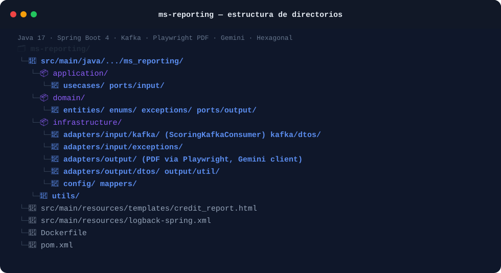

# ms-reporting

**Credit-report generation microservice for the RIntellix credit-risk platform.**

`Java 17` · `Spring Boot 4` · `Apache Kafka` · `Thymeleaf` · `Playwright` · `Google Gemini` · `Hexagonal Architecture`

---

## 1. Overview

`ms-reporting` turns a finished risk scoring result into a human-readable **PDF credit report**.
It is entirely event-driven: it does not expose REST endpoints for the report-generation flow
itself — it reacts to a Kafka event published once a simulation has been scored, renders an HTML
report from a Thymeleaf template, converts it to PDF, and hands the file back to `ms-core-data`
for storage.

Responsibilities at a glance:

- Consume the scoring-completed event from Kafka (published by `ms-risk-engine`).
- Use **Google Gemini** to generate the natural-language explanation/summary sections of the
  report from the SHAP-based risk drivers.
- Render the report as HTML (Thymeleaf template `credit_report.html`) and convert it to PDF
  using a headless **Playwright/Chromium** instance.
- Deliver the resulting PDF to `ms-core-data` so it can be persisted and later downloaded.

## 2. Key aspects of the system

- **Hexagonal architecture (ports & adapters).** `domain` (entities, enums, exceptions, output
  ports), `application` (use cases, input ports), `infrastructure` (Kafka consumer, PDF/AI
  output adapters, configuration).
- **Fully event-driven, no public API.** `ScoringKafkaConsumer` is the only entry point; there
  is no REST controller in this service, by design.
- **HTML-to-PDF rendering with Playwright.** Rather than a traditional PDF library, the report
  is first rendered as HTML (Thymeleaf) and then converted with headless Chromium via
  Playwright, allowing the same styling/layout tools used for web pages.
- **Generative AI–assisted narrative.** The `google-genai` dependency is used to turn structured
  SHAP explainability output into a readable narrative section of the report.
- **Resilience on outbound calls.** `spring-retry` and `aspectjweaver` back retry logic around
  the AI/model-generation calls, so transient failures don't fail the whole report.

### Repository structure

The following schematic illustrates the source code layout and how the key architectural pieces described above map to the main project folders:



## 3. Tech stack

- **Language / runtime:** Java 17
- **Framework:** Spring Boot 4 (`spring-boot-starter-web`, `spring-boot-starter-webflux`,
  `spring-boot-starter-validation`, `spring-boot-starter-actuator`, `spring-boot-starter-thymeleaf`)
- **Messaging:** `spring-kafka`
- **Report rendering:** Thymeleaf (HTML) + Microsoft Playwright (HTML → PDF)
- **Generative AI:** Google Gemini (`google-genai`)
- **Resilience:** `spring-retry`, AspectJ
- **Utilities:** Lombok, Jackson

## 4. Prerequisites

- JDK 17+
- Maven 3.9+

## 5. Getting started

> `**IMPORTANT**`

> **Global platform deployment**:
> This repository contains only the reporting service code. To spin up the entire RIntellix platform (including this service, Kafka, Keycloak, and the rest of the microservices), clone the main infrastructure repository **[TFG-RIntellix/rintellix-deployment]** and follow its instructions.

The following commands are provided for local development, code review, and testing:

```bash
# 1. Clone the repository
git clone https://github.com/TFG-RIntellix/ms-reporting.git
cd ms-reporting

# 2. Build and run local tests
mvn clean test
```

> **Note for local development:** running Playwright tests locally requires the Chromium browser and its native dependencies (fonts, `libnss3`, `libgbm1`, etc.) to be installed.

## 6. Configuration

The following properties are consumed via `application.yaml` or corresponding environment variables:

| Property | Description | Default |
|---|---|---|
| `spring.kafka.bootstrap-servers` | Kafka broker bootstrap servers | `localhost:9092` |
| `app.kafka.topics.scoring-result` | Scoring result topic to consume | `risk.scoring.result` |
| `gemini.api-key` | Google Gemini API credentials | *(required)* |
| `app.clients.core-data.url` | Base URL of `ms-core-data` for storing PDFs | `http://localhost:8081` |
| `server.port` | Internal port the service listens on | `8083` |

## 7. Related services

- **ms-risk-engine** — publishes the scoring event this service consumes.
- **ms-core-data** — stores the generated PDF and serves it for download.

## 8. Author

Lucía Fernández Mancebo — TFG *RIntellix*, Universidad de Cantabria.


